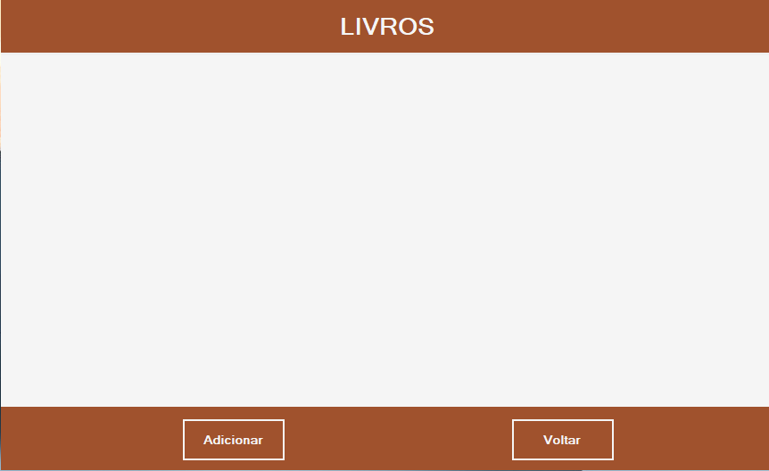
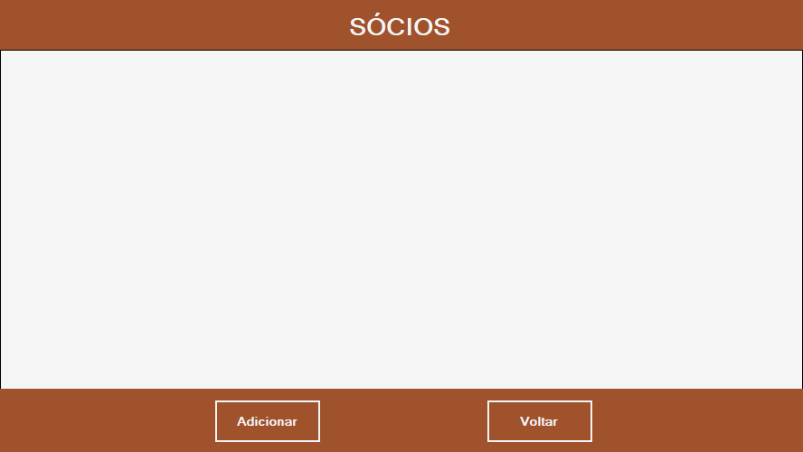

# Projeto_SitemaBiblioteca 📚🕓

◽ Projeto realizado com finalidade de exercitar o aprendizado em .NET FRAMEWORK, e
 a instegração do banco de dados MySQL através do XAMPP, em base de demonstrar um sistemas de cadastro de sócio e cadastro de livros.

◽ Assim que o sócio ou livro é cadastrado, o sistemas mostra todas as informações que foram preenchidas e armazenadas no MySQL nos Forms respectivos. 

<h3>1° Frm_Apresentação 📸<h3>

<h3>2° Frm_Abertura 📸<h3>

<h3>3° Frm_cadastroLivro 📸<h3>

<h3>4° Frm_sistemaLivros 📸<h3>

<h3>5° Frm_cadastroSocio 📸<h3>

<h3>6° Frm_sistemaSocio 📸<h3>

